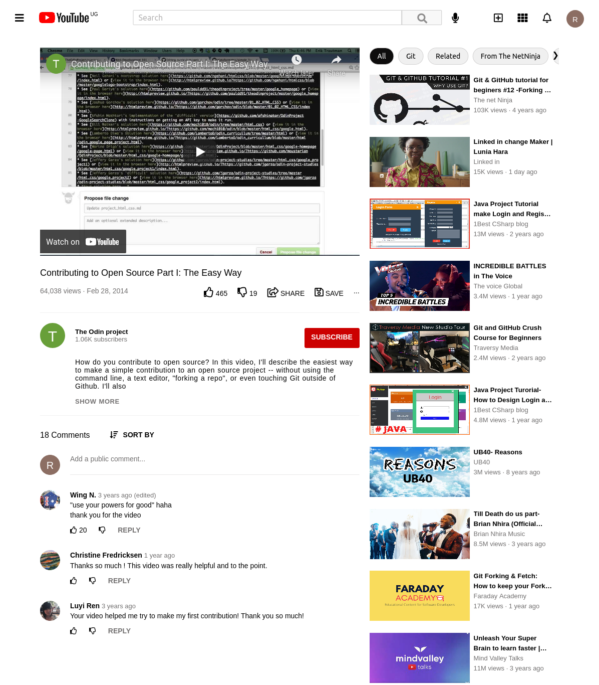

# Youtube_clone
> This project is a youtube clone built to demostrate the author's learned knowledge of HTML5 and CSS3.


## Screenshot


>This project was made to demonstrate the my understanding of basic HTML5 and CSS3 concepts; 
The ability to work with backgrounds, background and thumbnail-images in HTML, and portrayal of my understanding of embedding videos in an HTML webpage.

## Built With
- HTML
- CSS

## Live Demo 
[Live Link](https://raw.githack.com/RachealNakalawa/Youtube_clone/featureheader/index.html)

## Getting Started
To get a local copy of this repository, please run the following commands on your terminal

```
$ cd <folder>(This is a folder of your choice)
```

```
$ git clone https://github.com/RachealNakalawa/Youtube_clone.git
```

```
cd in to <Youtube_clone> folder and Open the index.html file in a browser of your choice.
```

## Authors

👤 **Racheal Nakalawa**

- Github: [RachealNakalawa](https://github.com/RachealNakalawa)
- Twitter: [@RachealNakalawa](https://twitter.com/RachealNakalawa)
- Linkedin: [racheal-nakalawa](https://linkedin.com/in/RachealNakalawa)

# 🤝 Contributing

Contributions, issues and feature requests are welcome!

Feel free to check the [issues page](https://github.com/RachealNakalawa/Youtube_clone/issues).

## Show your support

Give a ⭐️ if you like this project!

## Acknowledgments

- This project was originally taken from [The Odin project](https://www.theodinproject.com/paths/full-stack-javascript/courses/html-and-css/lessons/embedding-images-and-video)
## 📝 License

This project is [MIT](lic.url) licensed.